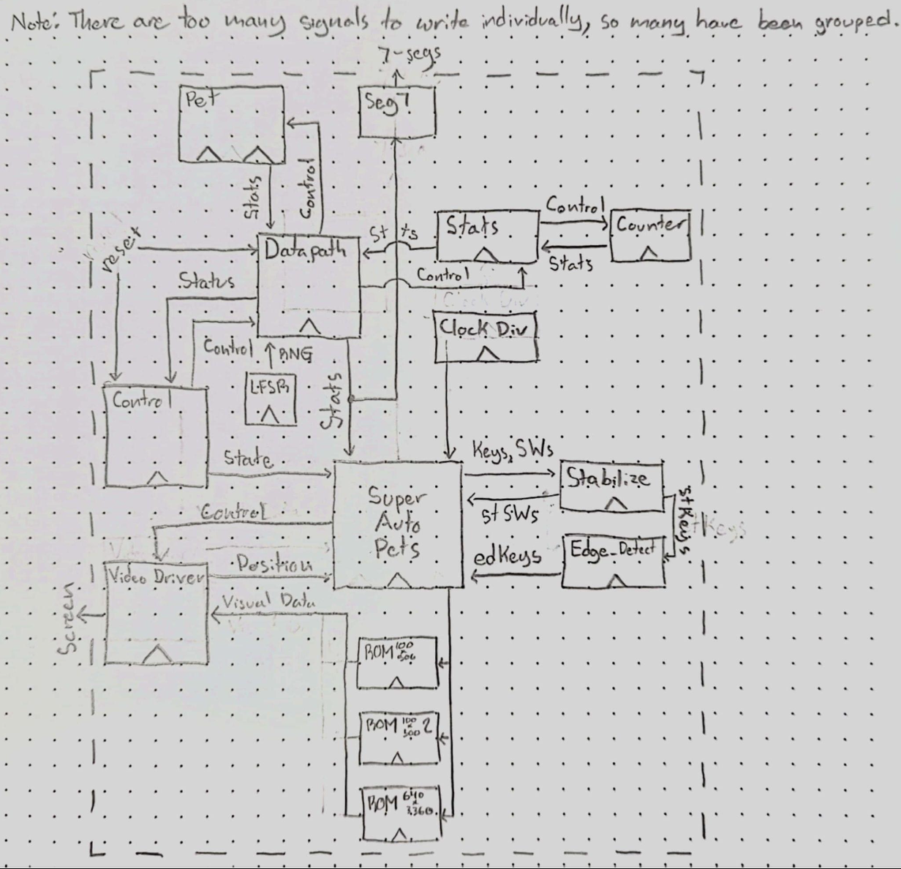
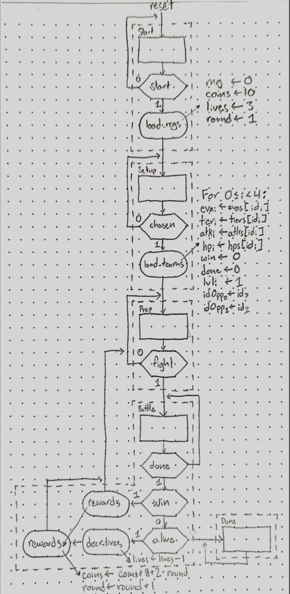

# Auto Pets

Created by Sara Deutscher and Lincoln Lewis

## Top Level Module
* **SuperAutoPets.sv** - The top level modules used to instantiate the helper modules, video driver, and ROMS. This module also deals with drawing the screens/pets to the screen based on the signals. Based on signals from the helper modules that deal with the game logic, it will read the corresponding screen, pets, and opponents from the ROM modules and tell the video_driver to draw the output x,y coordinate pixel black/white according to the output from the ROM.

## Visual Logic
* **video_driver.sv** - Provided. Uses a 640x480 pixel resolution. Outputs x and y coordinates that the user (in this case top level module SuperAutoPets) can then specify the RGB values to color that pixel.

 ## ROMs
* **rom100x500.v** - 2-port ROM module that stores the all 4 pet options that the user can select (pig, cat, fish, goat) and a “fainted” screen to indicate that the pet has died during the battle phase. The rom is initialized from the pets.mif file that stores the binary data of the black and white images. This ROM is 2-port so that we can read the addresses of 2 different pets at the same time.
* **rom100x500_2.v** - A second 2-port ROM module that stores the same pets as the first ROM module. This one is used to select the opponent’s pets. It is also 2-port so that both opponent pets can be read out at the same time.
* **rom640x3360.v** - A single-port ROM module that stores all of the game-play screens. This includes a start screen, team selection screen, planning screen where you can level up your pets, battle screen, and game over screen. This was initialized from a screens.mif file that was created by using the image_to_verilog python script on our created images.

## ASMD Logic
* **control.sv & datapath.sv** - These modules are explained in detail below, under the Main ASMD Chart.

## Miscellaneous / Helper Modules
* **pet.sv** - A module containing various base stats, current stats, and “functions” for both the player’s and the opponent’s teams of 2 pets each. Pulling much of its information from the ASMD’s datapath, this module allows for a player selecting 2 out of 4 pet options, leveling up these pets, generating randomized opponent teams with random levels, roughly scaling with the round number, and healing all pets after each battle. Additionally, during battles, pets may attack, or the active pet may switch if one has died.
* **stats.sv** - A module that handles and stores the 3 main general statistics for this game, being your coin count, the current round number, and your remaining lives, which are all displayed to the player. Each stat had different initial values and varying count magnitudes and directions, requiring use of a very general counter module.
* **counter.sv** - A helper module for stats, as each statistic may be incremented or decremented by a known integer amount. Since it is used for 3 decently different stats, this counter was made to be quite flexible, allowing any data width and initial value, having togglable counting, and allowing counting up or down by any input value.
* **clock_divider.sv** - A module that splits an input clock into 50 slower clocks, each with a period that is an integer power of 2 longer than the input clock. In our case, since most of the code had to run fast so as to not cause input or visual delay with the exception of the battle logic, which was built to run at a pace a human could easily see and understand, we needed a much slower clock such as this to achieve said battle speeds.
* **stabilize.sv** - A module that takes in an input signal and a clock, and outputs a slightly delayed version of the input signal with ideally corrected metastability. Our game has various user inputs of various kinds, meaning we automatically needed some way to handle metastability.
* **edge_detector.sv** - A module that takes in an input signal and a clock, and outputs the posedge of the input signal with respect to the given clock. Since our game had some button press keybinds that must activate exactly once per press, we needed a way to convert input signals which may be high for many clock cycles into a signal that is high for just one clock cycle at a time.
* **16_bit_LFSR.sv** - A 16-bit Linear Feedback Sheet Register that is initialized to 0 on system reset and progresses once per clock cycle. Since our game needs both hitrates which are fundamentally based on RNG and randomized opponent teams, we needed a way to produce random numbers. Additionally, since sometimes multiple busses are generated using this RNG simultaneously, we found that 16 bits to pull from was the minimum sufficient number.
* **seg7.sv** - A binary to 7-segment display conversion module. We decided that it would be far simpler to show stats such as coins, round number, and remaining lives on the built in 7-segment displays than adding it to the video_driver adjacent logic, so that is the path we chose.
* **CLOCK25_PLL.v** - Provided.
* **CLOCK25_PLL_0002.v** - Provided.
* **altera_up_avalon_video_vga_timing.v** - Provided.

## Top Level Block Diagram

## ASMD Chart
The program starts by showing a Start screen while in the respective state.    
When the user presses key0, all necessary general statistics are initialized, and the screen switches to a team Setup screen where the user must choose 2 pets for their team.    
Once a team has been selected, an opponent team is generated at random and all stats for each of the 4 pets are initialized. The player can now Prepare for a battle.    
When the player is ready, they can press key2 to start a Battle, which will continue until one team has been fully eliminated. Once the battle is done, if the player remains alive but did not win the fight, their remaining lives will be decremented, though if this round was their last, they are shown a Game Over screen in the Done state, where they will remain indefinitely. In any case, if the player did survive the battle, they will receive coin rewards and be advanced to the next round.    

